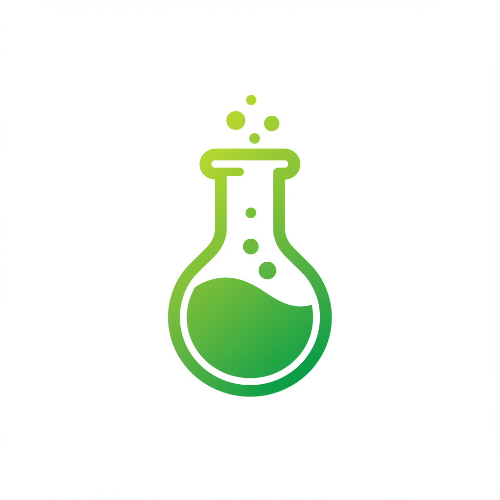

# PromptVault



PromptVault is a modern web application for managing and organizing AI prompts. It provides an intuitive interface for creating, storing, and exporting prompts with support for image references.

## Features

- 🎨 **Modern UI with Dark/Light Mode**
  - Clean, responsive design
  - Theme persistence
  - Smooth transitions

- 📝 **Prompt Management**
  - Create and organize prompts
  - Drag and drop reordering
  - Real-time preview
  - Project-based organization

- 🖼️ **Image Support**
  - Drag and drop image upload
  - Multiple image formats (PNG, JPG, GIF, WebP)
  - Image preview grid
  - Image reference management

- 📤 **Export Options**
  - Text (.txt) export
  - JSON format with images
  - Markdown with embedded images
  - Quick copy to clipboard

## Tech Stack

- **Frontend**
  - React
  - Material-UI
  - React Beautiful DND
  - Axios

- **Backend**
  - Node.js
  - Express
  - MongoDB
  - Mongoose

## Deployment Guide

### Prerequisites

1. Create accounts on:
   - [GitHub](https://github.com) (for source code)
   - [MongoDB Atlas](https://www.mongodb.com/cloud/atlas) (for database)
   - [Render](https://render.com) (for hosting)

### Step 1: Set Up MongoDB Atlas

1. Create a new cluster (Free tier is fine)
2. Create a database user:
   - Go to Security → Database Access
   - Add new user with read/write permissions
3. Get connection string:
   - Go to Clusters → Connect
   - Choose "Connect your application"
   - Copy the connection string
   - Replace `<password>` with your database user's password

### Step 2: Deploy to Render

1. Fork/Clone this repository to your GitHub account

2. Connect to Render:
   - Go to [Render Dashboard](https://dashboard.render.com)
   - Click "New +"
   - Select "Web Service"
   - Connect your GitHub repository

3. Configure the Web Service:
   - Name: `promptvault-api`
   - Environment: `Node`
   - Build Command: `npm install`
   - Start Command: `node server/server.js`
   - Add Environment Variables:
     ```
     NODE_ENV=production
     MONGO_URI=your_mongodb_connection_string
     PORT=10000
     ```

4. Deploy Static Site:
   - Click "New +"
   - Select "Static Site"
   - Connect same repository
   - Configure:
     - Name: `promptvault-web`
     - Build Command: `cd client && npm install && npm run build`
     - Publish Directory: `client/build`

5. Update API URL:
   - Go to your static site settings
   - Add environment variable:
     ```
     REACT_APP_API_URL=https://your-api-service-url.render.com
     ```

### Step 3: Verify Deployment

1. Wait for both services to deploy
2. Check the logs for any errors
3. Visit your static site URL
4. Test the application functionality

## Local Development

### Prerequisites

- Node.js (v14 or higher)
- MongoDB
- Git

### Installation

1. Clone the repository:
   ```bash
   git clone https://github.com/dowells-mike/prompt-vault.git
   cd prompt-vault
   ```

2. Install dependencies:
   ```bash
   npm install
   cd client && npm install
   ```

3. Create a .env file in the server directory:
   ```env
   MONGO_URI=your_mongodb_connection_string
   PORT=5000
   ```

4. Start the development server:
   ```bash
   npm run dev
   ```

The app will be available at `http://localhost:3000`

## Contributing

Contributions are welcome! Please feel free to submit a Pull Request.

## Contact

Mike Dowells - [@dowee.y](https://www.instagram.com/dowee.y/)

- Email: mikedowells150@gmail.com
- LinkedIn: [dowells-mike](https://www.linkedin.com/in/dowells-mike)
- GitHub: [@dowells-mike](https://github.com/dowells-mike)

## License

This project is licensed under the MIT License - see the [LICENSE](LICENSE) file for details.

## Acknowledgments

- Thanks to all contributors
- Built with React and Material-UI
- MongoDB for database
- Express for backend
